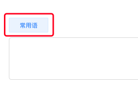
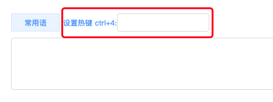
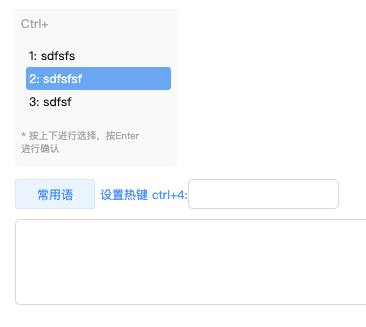
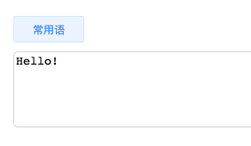

# NCC-Project

## 目录结构：
* test 测试文件
* core.js viewModel和工具类
* index.css 页面样式
* index.js 业务逻辑代码
* index.html 入口文件

## 主要功能
1. 创建热键
    点击[常用语]按钮弹出创建热词输入框，输入后按Enter保存热词。
    
    
    

2. 唤醒面板
    在聊天输入框内长按Ctrl-l可弹出热键选择列表，使用上下方向键可选择保存词条，输入Enter可选择词条

    

3. 使用热键
    在聊天输入框内同时按下Ctrl-l + [1-9]数字按键可直接输入对应热键的词条

    